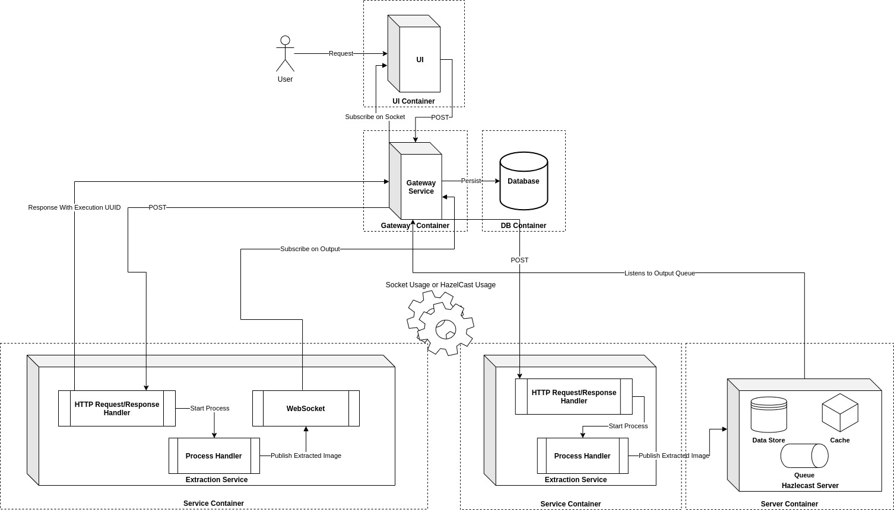
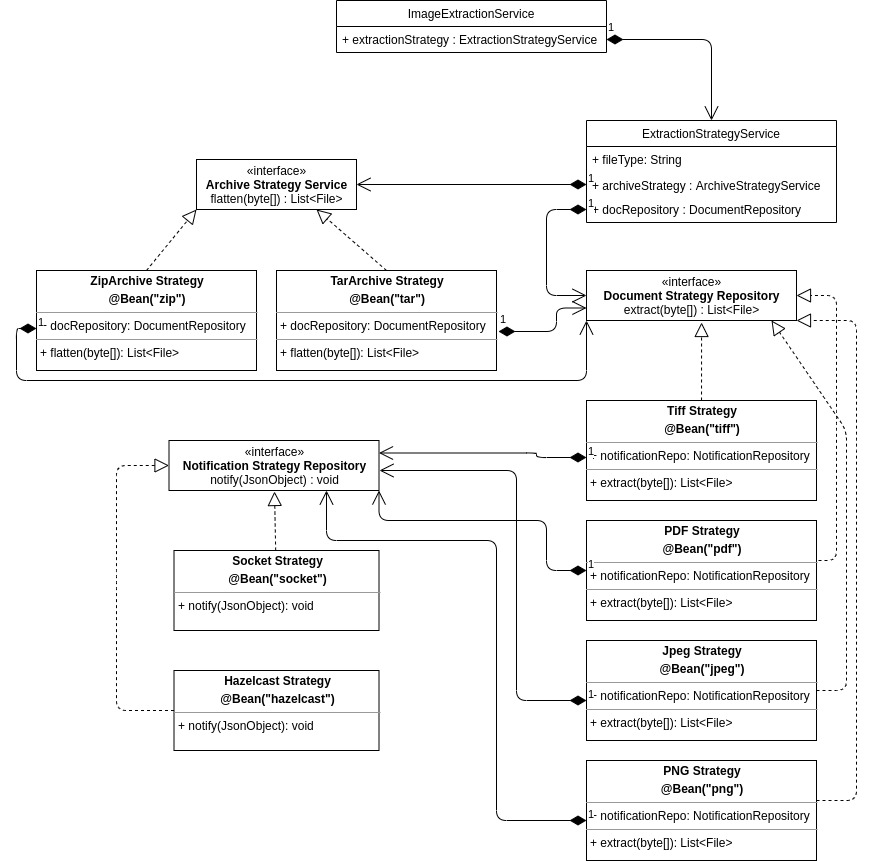

# Image Extraction Service
- Service to Extract Image from PDF,Jpg,Zip,Tar Archives and provide as png.

## To Start the Service 
### Prequisits
* JDK 1.11 or above to be installed.
* maven 3 or above to be installed.

1. from project directory where `pom.xml` exists, type 
    ```
    mvn clean install
    ```
2. Go to `target` folder and then type
   ```
   java -jar image-extraction-1.0.jar
   ```
3. Open any browser (prefebly chrome), type
   `http://localhost:5458`
   it will open a web page with `connect` button.

4. Press `connect` button to get the user as `socket-client-id`
5. use below client request to test the service.
   ```
   curl --location --request POST 'localhost:5458/extract' \
    --header 'socket-client-id: 872895ca-91c6-41b0-9c82-caa95f5aead4' \
    --header 'meta: {"some":"value"}' \
    --header 'Content-Type: application/zip' \
    --data-binary '@<user home>/inputs.zip'
   ```
   or
   ```
    POST /extract HTTP/1.1
    Host: localhost:5458
    socket-client-id: 872895ca-91c6-41b0-9c82-caa95f5aead4
    meta: {"some":"value"}
    Content-Type: application/zip
    <file contents here>
    ``` This `POST` call will return a `job-id` which can be used to download the extracted images as archive.
6. The extracted `png` images will appear to your browser as extracted data.
7. To download the `png` as archive use below client call
   ```
   curl --location --request GET localhost:5458/get/d0c10ebb-e2b0-4257-a5cd-206b5b52697b
   ```

# Use case


# Data Flow


# Overall Architecture


# Internal Strategy
